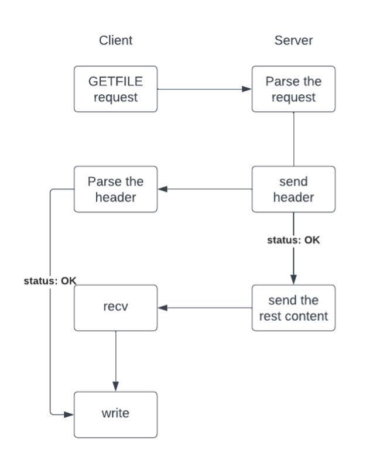
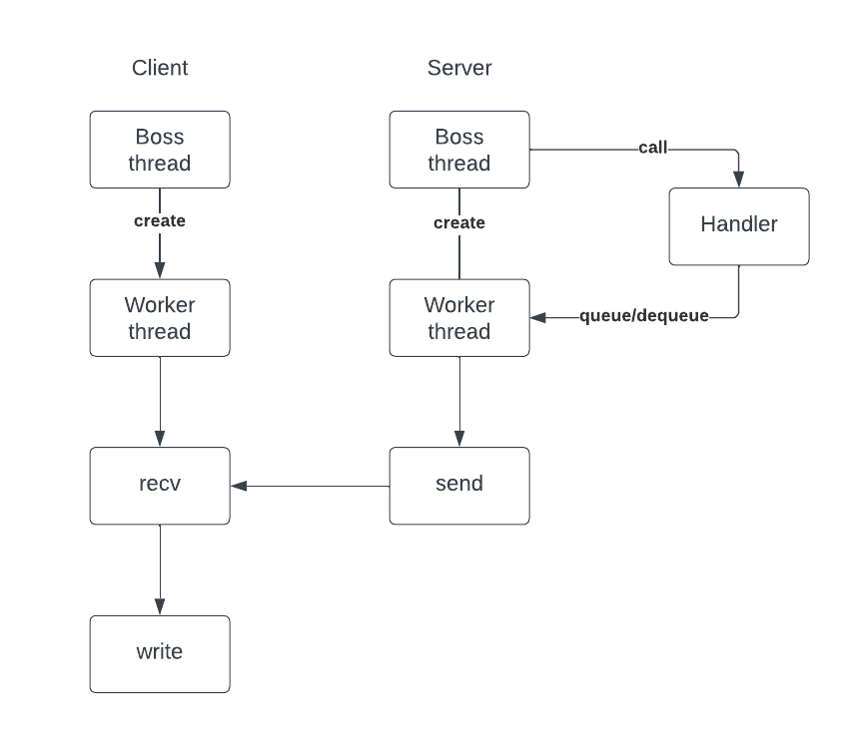
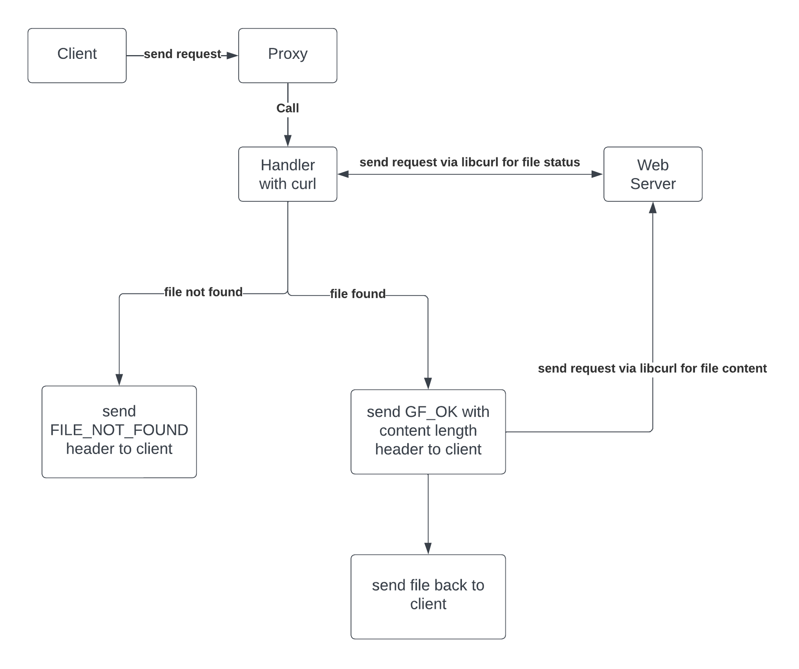
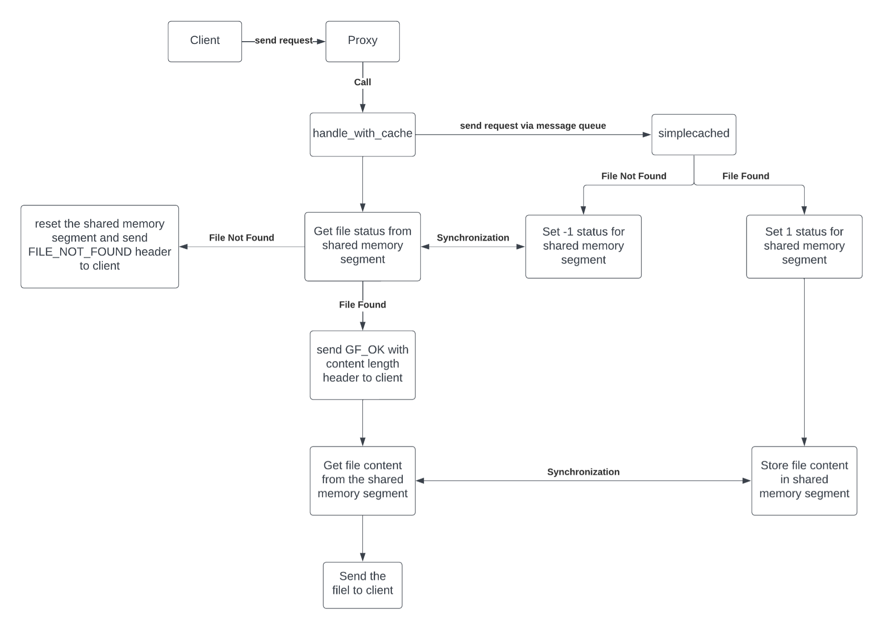
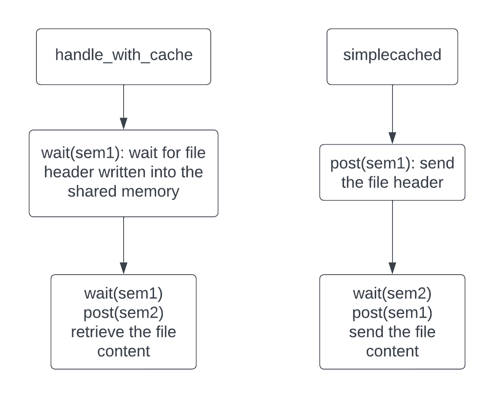
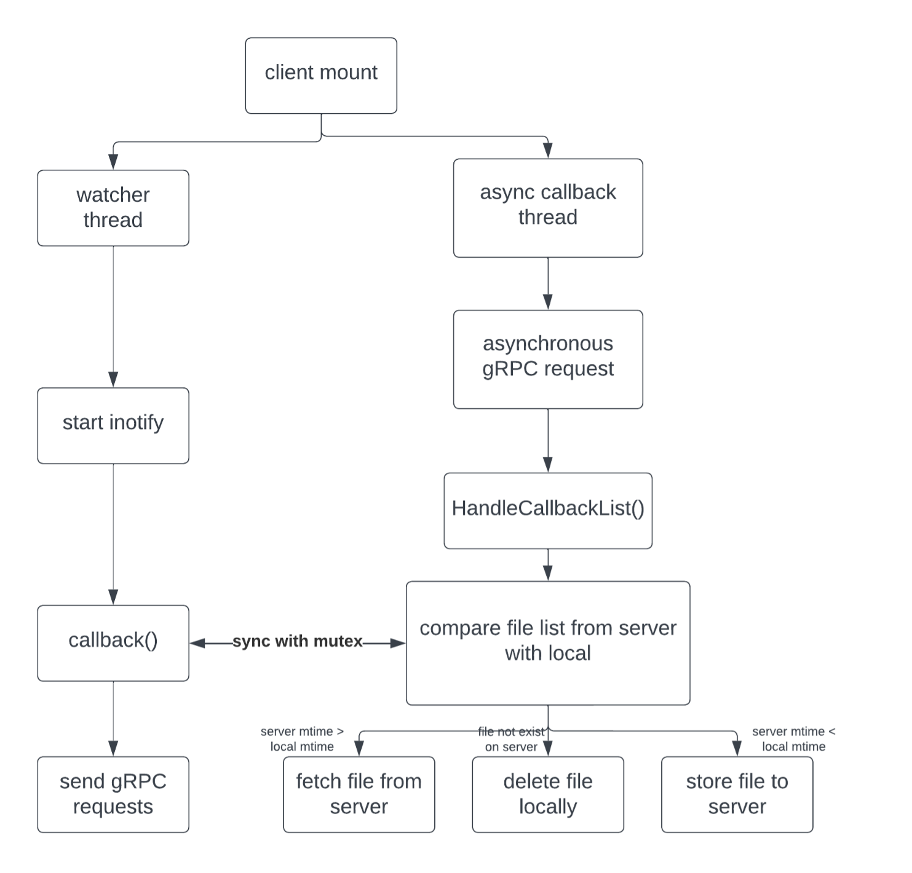

# Project Summary: Multithreading, IPC, GRPC, and Distributed Systems

This repository contains three projects implemented using C and C++: Multithreading, Inter-Process Communication (IPC), and GRPC with Distributed Systems. Each project aims to explore different aspects of concurrent programming, communication between processes, and building distributed systems using Google's GRPC framework. Below is a brief summary of each project along with instructions to run them.

## [Project 1: Multithreading](multithreading)

In this project, I designed and implemented a multi-threaded server that
serves static files based on the GetFile protocol, which is a simple HTTP-like
protocol. Alongside the server, I also created a multi-threaded client that acts as a load generator for the server. Both the server and client will be written in C and be based on a sound, scalable design.

### Workflow Design




## [Project 2: Inter-Process Communication (IPC)](ipc)

This project builds upon Project 1. In Project 1 we took you through a series of steps towards building a simplified web server. In _this_ project I started with a working getfile server and augment it:

1. **Part 1** I converted this implementation of the getfile server to act as a [proxy server](https://en.wikipedia.org/wiki/Proxy_server).
   This server will accept incoming GETFILE requests and translate them into http requests for another server,
   such as one located on the internet.
2. **Part 2** I implementeda simple [cache server](https://whatis.techtarget.com/definition/cache-server)
   that communicates with the proxy via **shared memory**.
   The design of this cache server is intended to permit its use with **multiple** proxy servers.

We have simplified this project by omitting requirements that are typically present in such systems, the most notable of which is that **we do not** require to _download and save_ files from the Internet. The servers that we have provided already implement threading, since I did that in a previous project.

### Workflow Design





## [Project 3: GRPC and Distributed Systems](grpc)

In this project, I designed and implemented a simple distributed file system (DFS). First, I developed several file transfer protocols using gRPC and Protocol Buffers. Next, I incorporated a weakly consistent synchronization system to manage cache consistency between multiple clients and a single server. The system should be able to handle both binary and text-based files.

My source code used a combination of C++14, gRPC, and Protocol Buffers to complete the implementation.

### Workflow Design



```

Feel free to explore each project's source code and modify them as needed to experiment with various aspects of multithreading, IPC, and distributed systems using GRPC.


```
